# 🧱 OPNsense Multi-Network Lab (VMware Workstation)

This project demonstrates the setup and configuration of **OPNsense 25.7** as a multi-interface firewall and router inside a **virtualized environment**.  
It simulates a small enterprise network with multiple departments — each on its own subnet — and shows how to route and control traffic between them.

---

## 🧠 Project Overview

**Goal:**  
Design a multi-network environment using **OPNsense** to route traffic between isolated LANs (e.g., Finance and General LAN), while maintaining secure internet access.

**Virtualization Platform:**  
VMware Workstation Pro

**Operating Systems:**
- **OPNsense 25.7 (Firewall/Router)**
- **Ubuntu 24.04 LTS (Clients)**

---

## 🌐 Network Topology

| Interface | Role | Network | IP/Subnet | Description |
|------------|------|----------|------------|--------------|
| `em0` | WAN | NAT | DHCP | Internet access via host |
| `em1` | LAN | 192.168.1.0/24 | Gateway: 192.168.1.1 | Internal office LAN |
| `em2` | Finance | 192.168.10.0/24 | Gateway: 192.168.10.1 | Finance subnet |
| `em3` | OPT2 | 192.168.20.0/24 | Gateway: 192.168.20.1 | Optional test subnet |

---

## ⚙️ Step-by-Step Configuration with Screenshots

### 🧩 Step 1: Installing OPNsense
**Goal:** Install OPNsense inside VMware and prepare it for network configuration.

- 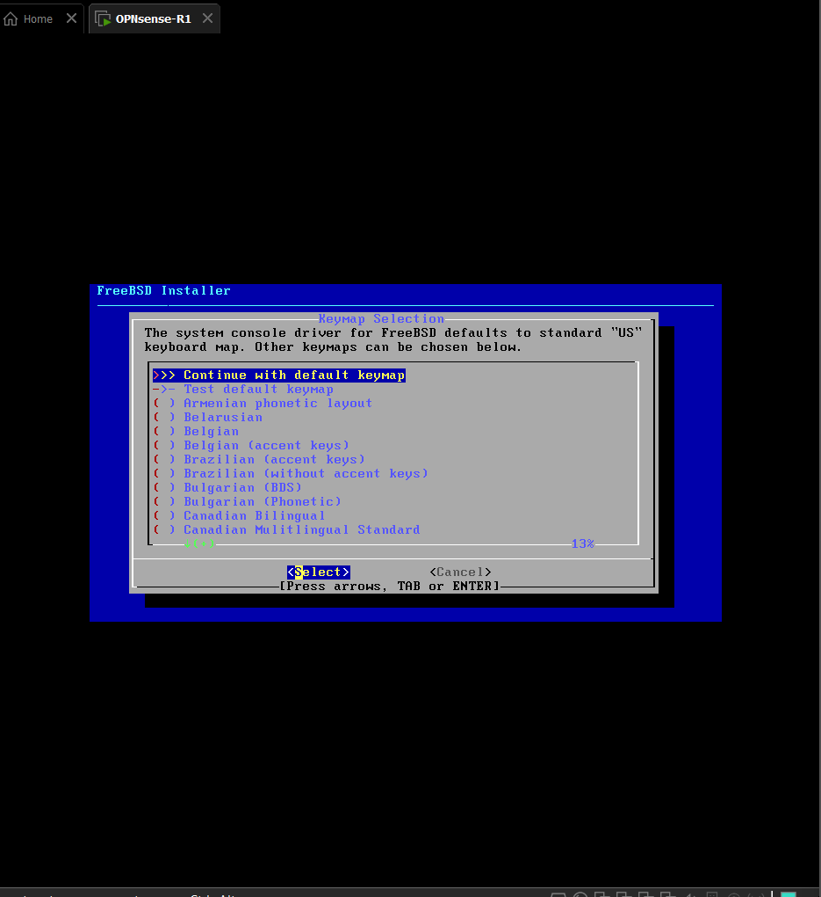  
  → Beginning the installation process for OPNsense in VMware.

-   
  → Installation finished successfully, ready for initial login.

---

### 🌐 Step 2: Interface Assignments
**Goal:** Assign each network interface (WAN, LAN, Finance, OPT2) to its corresponding VMnet network.

- 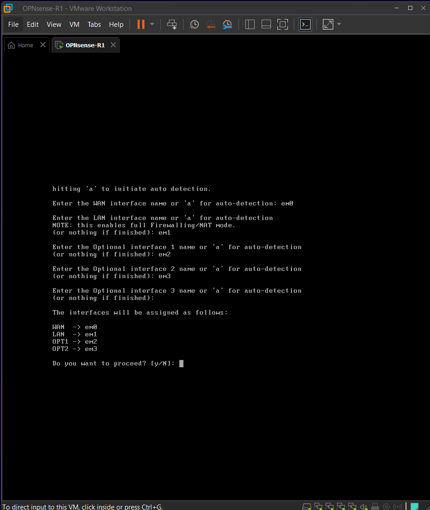  
  → Mapping each OPNsense adapter to a VMnet. Each VMnet simulates a separate physical network.

- 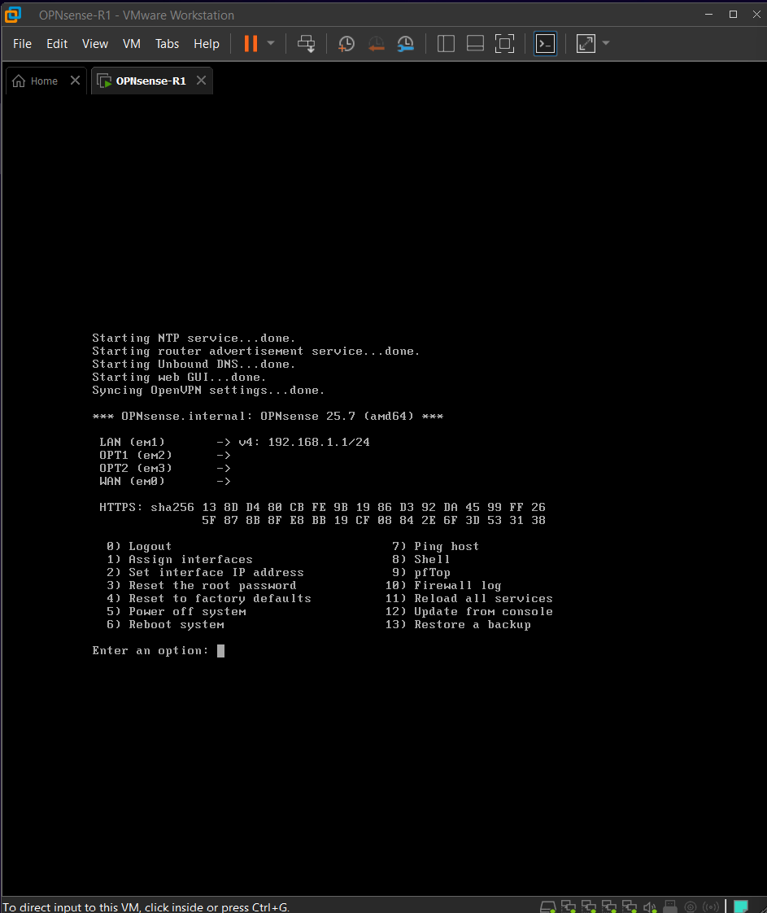  
  → Defining IP addresses for LAN and Finance networks inside OPNsense.

- 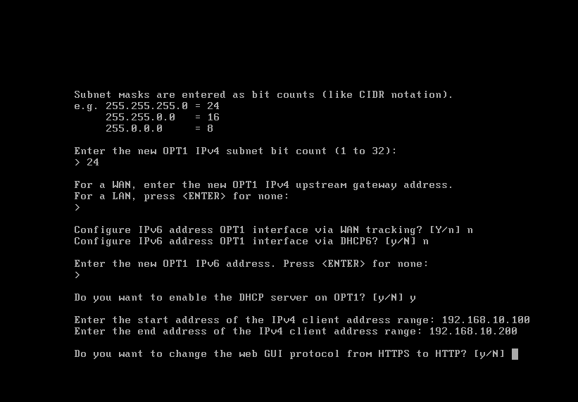  
  → Confirming all interfaces are correctly linked and recognized by OPNsense.

---

### 🧮 Step 3: DHCP and Network Configuration
**Goal:** Enable and configure DHCP for the LAN and Finance networks so Ubuntu clients can automatically receive IPs.

- 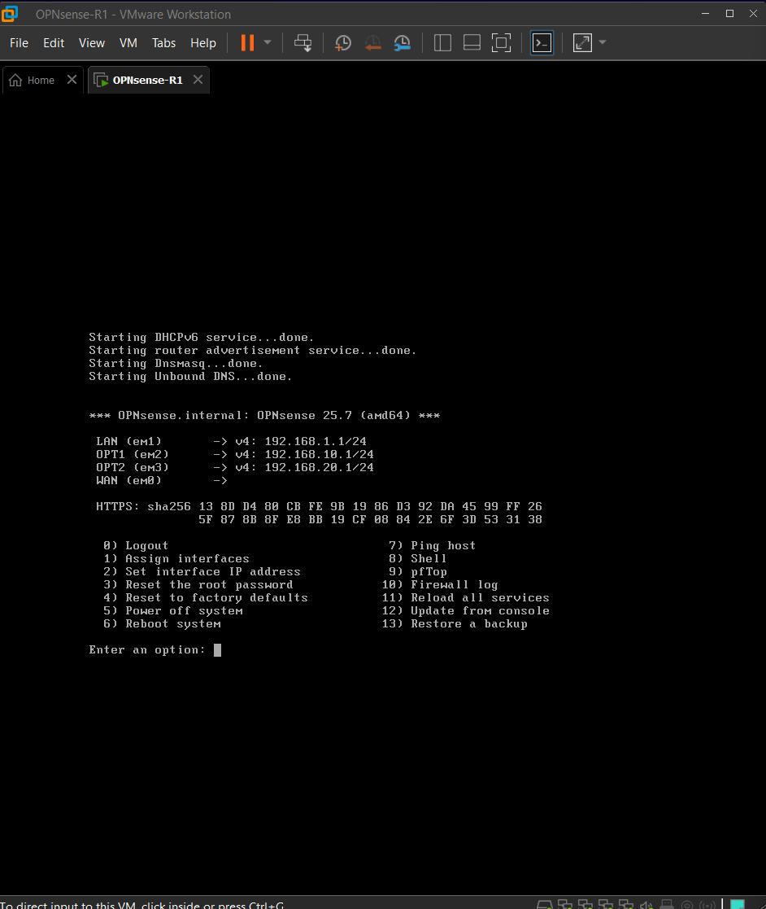  
  → Enabling the DHCP server on the Finance interface with proper range.

- 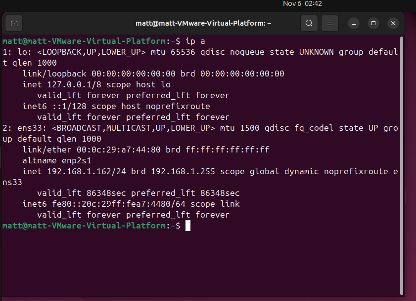  
  → Viewing running services (DHCP, DNS Resolver, etc.) to confirm functionality.

- 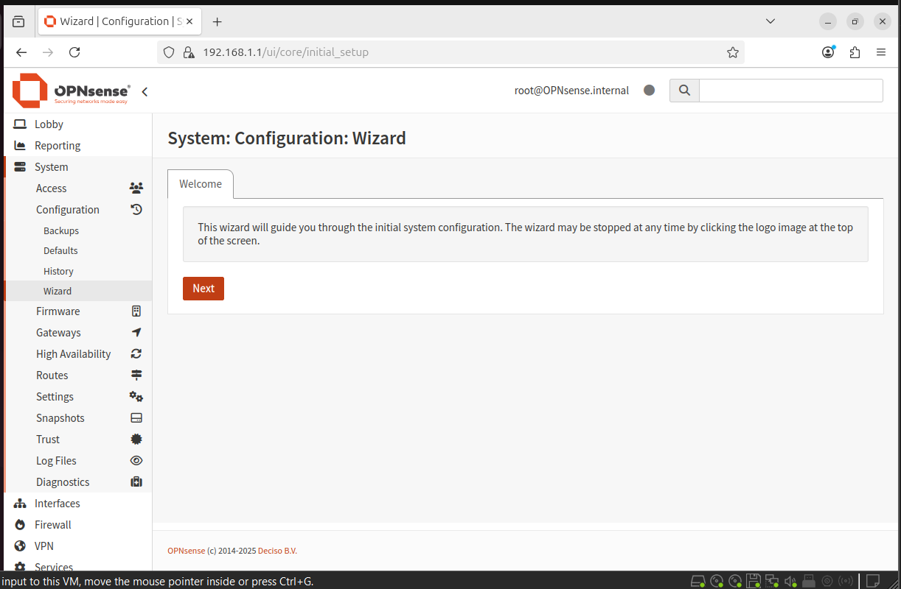  
  → Setting DHCP range for Finance subnet (e.g., 192.168.10.100–192.168.10.200).

- 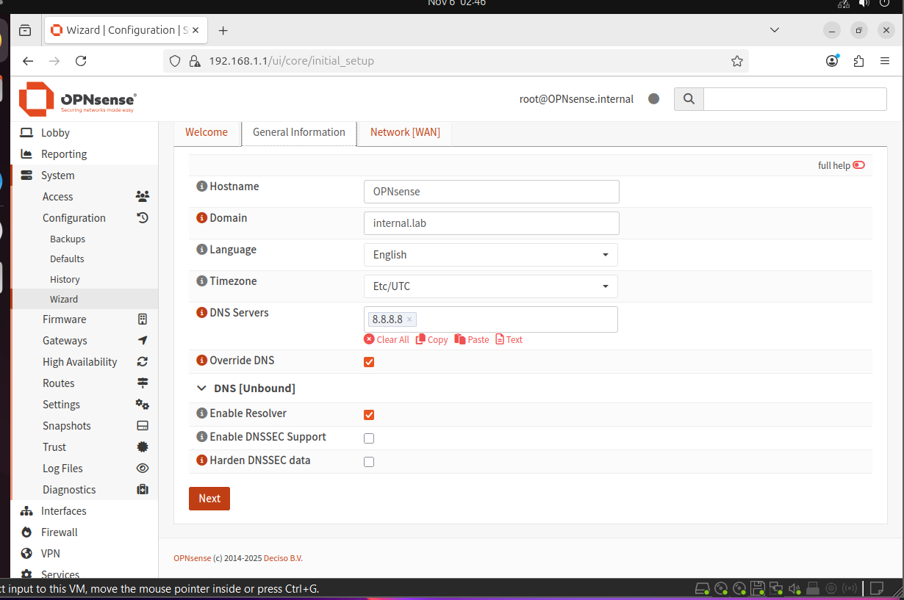  
  → Reviewing all interface IPs and DHCP settings before applying.

---

### 🧭 Step 4: Initial Web GUI Configuration
**Goal:** Access OPNsense via web GUI (https://192.168.1.1) and complete the setup wizard.

-   
  → Starting the configuration wizard via the browser.

- 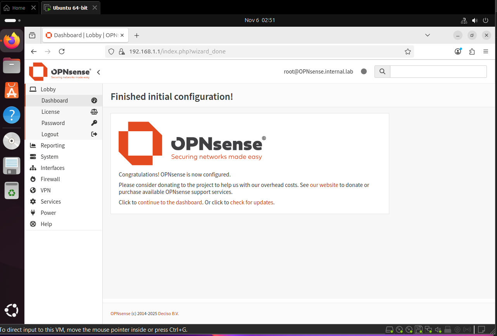  
  → Finishing setup and applying configuration defaults.

- 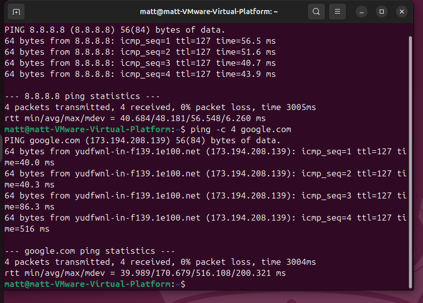  
  → The main OPNsense dashboard showing interface statistics, gateway status, and live traffic graphs.

---

### 🔥 Step 5: Firewall Rules and Connectivity Testing
**Goal:** Apply firewall rules to restrict/allow traffic between subnets and verify connectivity.

- 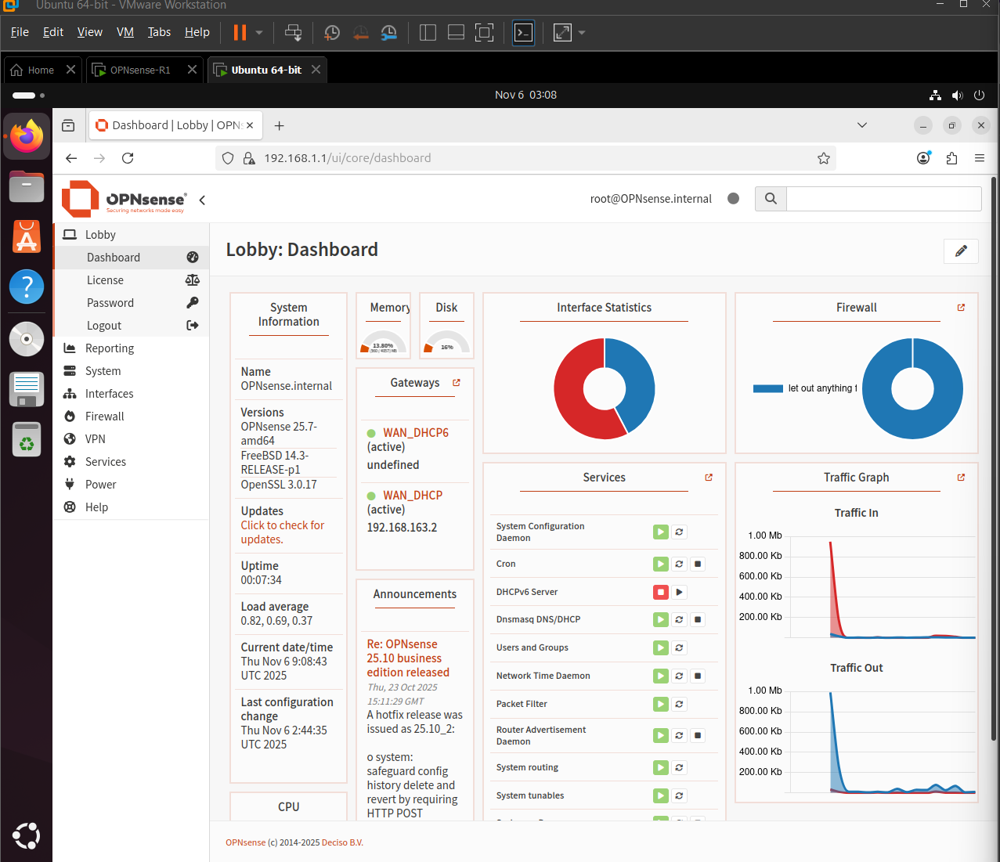  
  → Configuring rules on the Finance interface to control access to the LAN and internet.

- 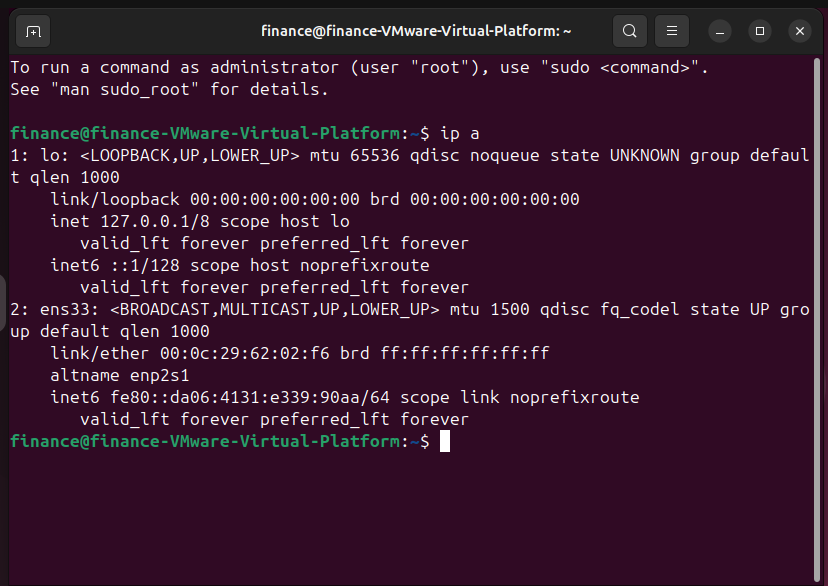  
  → Verifying isolation — Finance subnet cannot reach the internet until rule modification.

---

### 🧪 Step 6: Connectivity Verification
**Goal:** Ensure LAN devices can access the internet, and Finance subnet isolation works as expected.

-   
  → Successful ping to 8.8.8.8 and google.com from LAN client confirms outbound traffic works through OPNsense NAT.

---

## ✅ Results

- Successfully deployed a **multi-network OPNsense firewall** in a virtual lab.  
- Verified **LAN internet access** and **Finance isolation** via firewall rules.  
- Demonstrated how DHCP, routing, and interface separation function within OPNsense.  
- Captured screenshots for each critical step of the process.

---

## 🧰 Tools Used

| Tool | Purpose |
|------|----------|
| **VMware Workstation Pro** | Virtualization platform |
| **OPNsense 25.7** | Open-source firewall and router |
| **Ubuntu 24.04 LTS** | Client operating system |
| **PowerShell / Git** | Version control and documentation |

---

## 🪪 License
This project is licensed under the **MIT License** — free to use, modify, and share for educational purposes.

---
